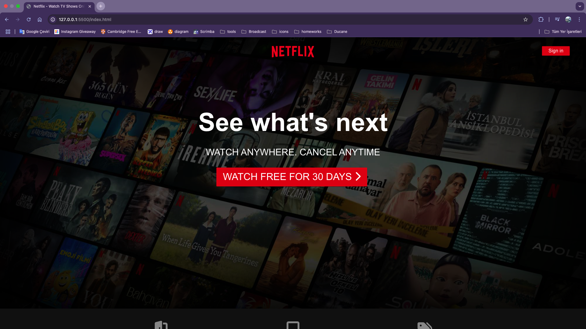
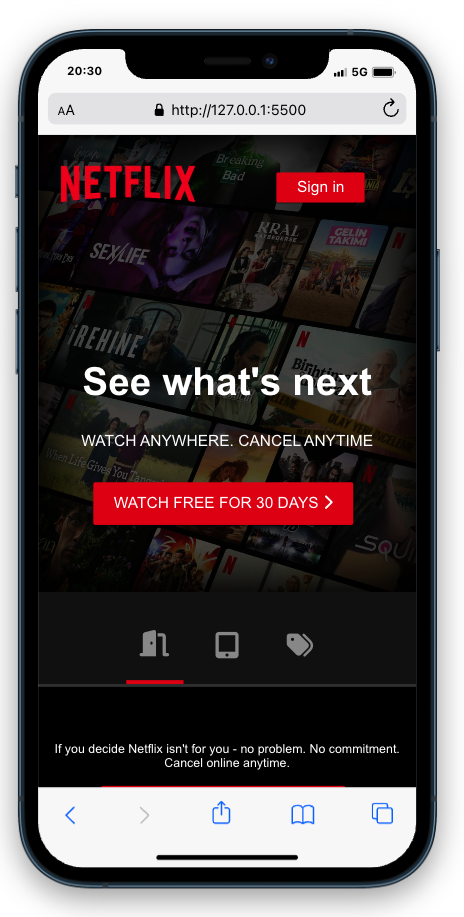
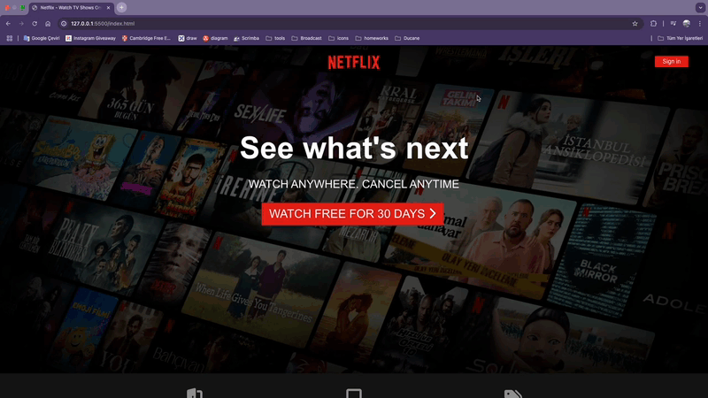

# Netflix Clone Landing Page

Bu proje, Netflix platformuna benzer bir açılış sayfası arayüzü oluşturan **Netflix Clone Landing Page** isimli web uygulamasıdır. **HTML**, **CSS**, **JavaScript** ve **SCSS** kullanılarak geliştirilmiştir. **Tamamen responsive** bir tasarıma sahiptir.

## ✨ Özellikler

* **Tamamen Responsive Tasarım**: Mobil, tablet ve masaüstü uyumlu modern görünüm.
* **Dinamik İçerik**: JavaScript ile kullanıcı etkileşimini artıran dinamik bölümler.
* **SCSS ile Gelişmiş Stil Yönetimi**: Daha düzenli, okunabilir ve ölçeklenebilir CSS.
* **Netflix’e Benzer Arayüz**: Kullanıcıya tanıdık gelen bir deneyim sunar.

## 📚 Kullanılan Teknolojiler

* **HTML5**
* **CSS3**
* **JavaScript**
* **SCSS**

## 🚀 Kurulum

Projeyi çalıştırmak için aşağıdaki adımları izleyin:

1. Bu repoyu klonlayın:

   ```bash
   git clone https://github.com/Bahadir34/netflix-clone-landing-page.git
   ```
2. Proje klasörüne gidin:

   ```bash
   cd netflix-clone-landing-page
   ```
3. `index.html` dosyasını tarayıcınızda açın.

## 🖼️ Ekran Görüntüleri




## 👤 Katkıda Bulunma

Projeye katkıda bulunmak isterseniz **pull request** açabilirsiniz.

## 🌐 Canlı Önizleme



---

_Bu proje eğitim ve portföy amaçlı geliştirilmiştir. Herhangi bir ticari amaç taşımamaktadır._
